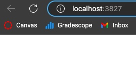
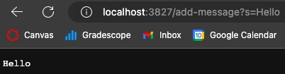
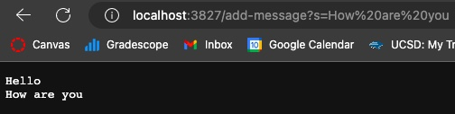
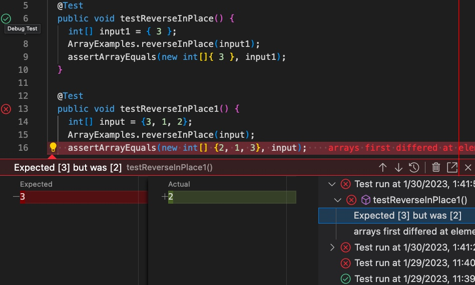

# **Lab Report 2 Servers and Bugs**
In week 2 of lab, we dove into running a website locally on our own computers, and even ran a website on a remote server. The following week, week 3, we focused more on bugs, testing code, and the process of debugging it.   
## Part 1
### Code for StringServer.java:
```
import java.io.IOException;
import java.net.URI;

class Handler implements URLHandler {
    // The one bit of state on the server: a number that will be manipulated by
    // various requests.
    StringBuilder str = new StringBuilder();

    public String handleRequest(URI url) {
        if (url.getPath().equals("/")) {
            return String.format(str.toString());
        }
        if (url.getPath().contains("/add-message")) {
            String[] parameters = url.getQuery().split("=");
            if (parameters[0].equals("s")) {
                str.append(parameters[1] + "\n");
                return String.format(str.toString());
            }
        }
        return "404 Not Found!";
    }
}

class StringServer {
    public static void main(String[] args) throws IOException {
        if (args.length == 0) {
            System.out.println("Missing port number! Try any number between 1024 to 49151");
            return;
        }

        int port = Integer.parseInt(args[0]);

        Server.start(port, new Handler());
    }
}
```
### StringServer Homepage:


### Add Message 1:


The method in the code that was called was `handleRequest(URI url)`. This method takes the url path and checks if it contains "/add-message". If the url does, the query is used to assess what the user is requesting by splitting the query at the equals sign. If the left-side of the query is "s" the code continues and appends the right-side of the query to a String Builder object. A newline character follows the appended string so that any words after will be appended onto a new line. This allows for the message from the user to be displayed on the website. The values that changed from the domain site was the path and query which led to a string being appened. 

### Add Message 2:


Similarly to the add message request above, `handleRequest(URI url)` was called. This method checks if "/add-message" was in the url and then splits up the query at the equal sign. The code then checks if the left-side matches "s" and then proceeds with appending the message on the right-side of the query into the String Builder object. This leads to the string builder object being converted into a string and displayed on the website right under Hello. This time only the query changed from the example above, which lead to a different string being appended to the website.

## Part 2
Failure-inducing input:
```
  @Test
  public void testReverseInPlace1() {
    int[] input = {3, 1, 2};
    ArrayExamples.reverseInPlace(input);
    assertArrayEquals(new int[] {2, 1, 3}, input);
  }
```
Input that doesn't induce a failure:
```
  @Test 
  public void testReverseInPlace() {
    int[] input1 = { 3 };
    ArrayExamples.reverseInPlace(input1);
    assertArrayEquals(new int[]{ 3 }, input1);
  }
```
Symptom: 



Buggy Code:
```
  static void reverseInPlace(int[] arr) {
    for(int i = 0; i < arr.length; i += 1) {
      arr[i] = arr[arr.length - i - 1];
    }
  }
```
Fixed Code:
```
  static void reverseInPlace(int[] arr) {
    int[] temp = new int[arr.length];
    for (int i = 0; i < arr.length; i += 1) {
      temp[i] = arr[arr.length - 1 - i];
    }
    for (int i = 0; i < arr.length; i += 1){
      arr[i] = temp[i];
    }
  }
```
The buggy code only was manipulating the inputted array and so when the code would switch values in the array, the array would also change values leading to the array becoming the same on both sides. The fix implements another temporary array to be manipulated which is then deep copied over to the inputted array so that the values are truly reversed.
## Part 3
Something that I learned from lab in week 2 was that you could put modifiers on terminal commands to make them do different, and more things. For example, I had messed up on copying wavelet onto the remote server, and had to remove the files including the directory. However, by only using `rm wavelet` I wasn't able to remove it because it was a directory. After consulting my T.A. I learned that by using `rm -r wavelet` I could remove all the files in the folder as the `-r` told `rm` to remove recursively. Something else I learned was that a website could be run locally on your own device, and a website is just code that is running on a port. It's intersting to think how today many people use the internet and websites without giving a second thought about how they run.
